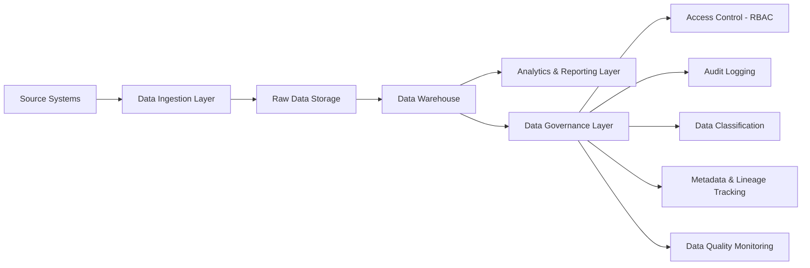
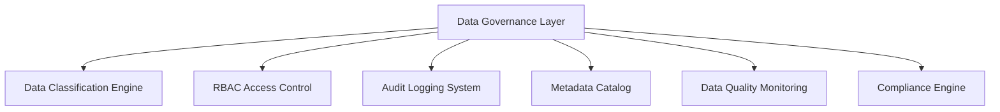
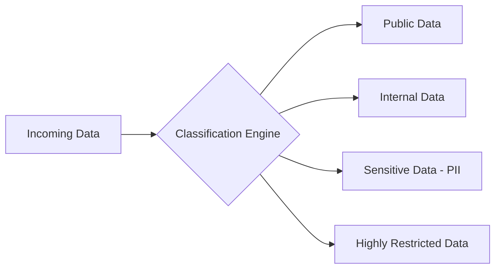
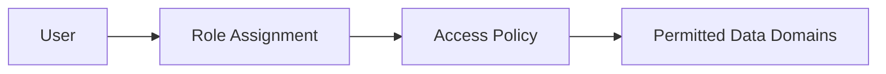
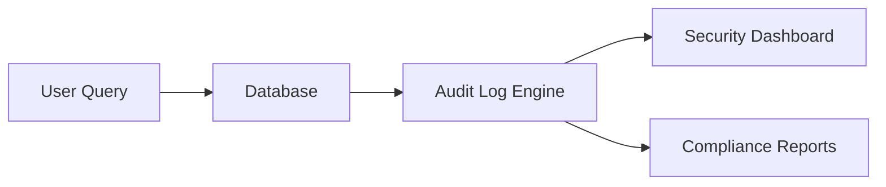
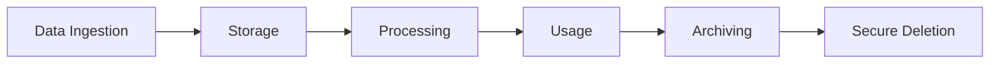

# Enterprise Data Governance and NDPA Compliance Framework for the Utility Sector

## Project Overview

This capstone project outlines a robust Enterprise Data Governance and NDPA Compliance Framework tailored for utility organisations. These entities handle vast quantities of sensitive data, including customer profiles, operational metrics, infrastructure details, and consumption patterns. The framework aims to unify disparate data silos into a centralised, secure, and compliant ecosystem that adheres to the Nigeria Data Protection Act (NDPA), incorporates GDPR-inspired privacy-by-design principles, and follows industry-leading data governance best practices.

By implementing secure data lifecycle management, this architecture ensures data integrity, confidentiality, and availability while mitigating risks associated with regulatory non-compliance, data breaches, and operational inefficiencies. The end result is a scalable, auditable data platform that supports strategic business objectives, fosters trust among stakeholders, and enables advanced analytics without compromising security or privacy.

## Objectives

The primary objectives of this framework are multifaceted, focusing on protection, standardisation, and optimisation:

- **Data Protection**: Safeguard personally identifiable information (PII) and personally sensitive information (PSI) through privacy-by-design methodologies, including encryption, anonymisation, and consent-driven processing.
- **Standardisation**: Develop enterprise-wide data classification standards to ensure consistent handling and categorisation of data assets.
- **Access Management**: Implement granular role-based access control (RBAC) to restrict data access based on user roles, responsibilities, and business needs.
- **Auditability**: Achieve comprehensive tracking of data interactions, including access logs, modifications, and usage patterns, to support forensic analysis and regulatory audits.
- **Metadata Management**: Provide full visibility into data metadata and lineage, enabling traceability from source to consumption.
- **Quality Assurance**: Enhance data quality through automated validation, monitoring, and remediation processes to maintain accuracy and reliability.
- **Strategic Alignment**: Integrate data management practices with overarching business strategies, promoting data-driven decision-making and operational excellence.

## Architecture Overview

  

## Business Context

Utility companies operate in a highly regulated environment, managing diverse datasets that are critical to service delivery and customer satisfaction. Key data categories include:

- **Customer Identity Data**: Names, addresses, contact details, and account information.
- **Billing and Payment Data**: Transaction histories, invoices, and financial records.
- **Metering and Consumption Data**: Real-time and historical usage metrics from smart meters and sensors.
- **Operational and Infrastructure Data**: Asset inventories, maintenance logs, and grid performance indicators.

These datasets are often fragmented across legacy systems, leading to challenges such as:

- Data silos that hinder cross-functional insights.
- Insufficient audit trails, increasing vulnerability to compliance violations.
- Gaps in regulatory adherence, particularly under NDPA mandates for data protection.
- Inconsistent data schemas, resulting in errors during integration and analysis.
- Inadequate access controls exposing sensitive information to unauthorised users.

This framework addresses these issues by establishing a unified governance model that reduces risks, streamlines operations, and enhances data utility.

## Governance Architecture Overview

The architecture is designed as a layered system, promoting modularity and scalability. It begins with data ingestion from heterogeneous sources and progresses through storage, processing, governance, and consumption layers.

This high-level design ensures that governance is embedded at every stage, facilitating secure and compliant data flows.

## Core Architecture Components

### 1. Data Sources
Diverse inputs form the foundation of the framework:
- Metering systems (e.g., IoT-enabled smart meters).
- Billing platforms (e.g., ERP-integrated financial systems).
- Customer Relationship Management (CRM) systems.
- Operational databases (e.g., SCADA for infrastructure monitoring).
- Field service management systems.

These sources generate structured, semi-structured, and unstructured data, necessitating robust ingestion mechanisms.

### 2. Ingestion Layer
This layer handles data acquisition with an emphasis on security and efficiency:
- **Extraction**: Pull data from sources via APIs, file transfers, or direct database connections.
- **Validation**: Initial checks for format compliance and basic integrity.
- **Standardization**: Normalize data schemas to align with enterprise standards.
- **Secure Transport**: Employ encryption (e.g., TLS) and secure protocols.

Recommended technologies include ETL/ELT tools like Apache NiFi or Talend for batch and real-time processing.

### 3. Storage Layer
A zoned approach supports data evolution:
- **Raw Data Zone**: Immutable storage for original ingested data (e.g., using data lakes like Amazon S3 or Azure Data Lake).
- **Staging Area**: Temporary holding for transformation and validation.
- **Curated Warehouse**: Structured repository for refined data (e.g., Snowflake or BigQuery).

Features include historical versioning, partitioning for performance, and retention policies compliant with NDPA.

### 4. Governance Layer (Core Framework Component)
The governance layer acts as the central enforcer of policies and controls.

This layer integrates security, compliance, and quality assurance, ensuring end-to-end oversight.

## Data Classification Model

Data is automatically classified upon ingestion to apply appropriate safeguards.

- **Public Data**: Open access with minimal restrictions.
- **Internal Data**: Limited to organizational users; basic encryption.
- **Sensitive Data (PII)**: Requires anonymization, consent tracking, and strict access logs.
- **Highly Restricted Data**: Multi-factor authentication, end-to-end encryption, and audit requirements.

Classification drives downstream policies for retention, encryption, and monitoring.

## Security and Access Control Model

RBAC ensures least-privilege access, minimizing exposure.

Examples of role mappings:
- Finance personnel: Access to billing and payment data.
- Engineering teams: Visibility into metering and infrastructure metrics.
- Data analysts: Query rights to anonymized, aggregated datasets.

Integration with identity providers (e.g., Azure AD) supports dynamic role adjustments.

## Audit and Monitoring Framework

Comprehensive logging captures all data interactions for accountability.

Logs include timestamps, user IDs, accessed elements, and actions performed. Dashboards (e.g., using ELK Stack) provide real-time alerts and reporting.

## Metadata and Lineage Tracking

This component offers transparency into data provenance:
- **Traceability**: Map data from origin through transformations.
- **Impact Analysis**: Assess downstream effects of changes.
- **Ownership**: Assign stewards for accountability.
- **Usage Metrics**: Track consumption patterns.

Tools like Microsoft Purview or Collibra facilitate cataloging and visualization.

## Data Quality Framework

Automated processes maintain data reliability:
- Completeness checks to identify missing values.
- Duplicate detection and resolution.
- Format and schema validation.
- Referential integrity enforcement.
- Anomaly detection using statistical models or ML algorithms.

Threshold-based alerts trigger remediation workflows.

## Data Lifecycle Management

A structured lifecycle ensures compliance throughout.

Policies align with NDPA, including data minimization and secure erasure.

## Compliance Alignment

The framework is built to meet:
- **NDPA Requirements**: Data protection impact assessments, breach notifications, and subject rights.
- **GDPR Principles**: Privacy-by-design, data portability, and controller-processor distinctions.
- **Enterprise Standards**: ISO 27001 for information security.

Key features: Consent management, minimal data collection, and encrypted storage.

## Technologies Referenced

- **Databases**: PostgreSQL or Oracle for operational storage.
- **Data Warehouses**: Snowflake or Redshift for analytics.
- **ETL/ELT Tools**: Apache Airflow or dbt for orchestration.
- **Metadata Management**: Azure Purview or Apache Atlas.
- **Access Management**: Okta or Active Directory.
- **Monitoring**: Prometheus, Grafana, or Splunk.

## Business Impact

Implementation yields tangible benefits:
- Reduced regulatory fines through proactive compliance.
- Enhanced data trust, enabling reliable analytics.
- Secure innovation in AI/ML-driven insights.
- Operational efficiencies via streamlined data access.
- Informed executive decisions supported by governed data.

## Portfolio Positioning

This project showcases proficiency in:
- Designing enterprise-scale data governance architectures.
- Architecting compliance-focused data platforms.
- Managing end-to-end data lifecycles.
- Modeling secure access and metadata systems.
- Integrating governance with business strategy.

It positions the author as a versatile data engineer capable of addressing complex regulatory and operational challenges.

## Author

Asimiyu Musa  
Data Engineer | Data Governance Specialist | Analytics Consultant  

## Portfolio

[View Portfolio](https://asimiyu-musa.github.io/project-portfolio/)

## License

This document is provided for portfolio and educational purposes only. All rights reserved. No commercial use without explicit permission.
📄 License

For portfolio and educational demonstration purposes.
